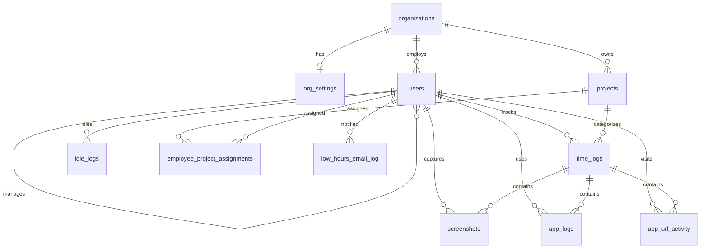

# Alyson Pulse — Simplified Schema

**RDS:** 11 tables + 1 view  
**S3:** screenshot image files (`.jpg` / `.png`)

```
S3                          RDS
┌─────────────────┐         ┌──────────────────┐
│ screenshot.jpg  │◄────────│ screenshots      │
│ (binary)        │  s3_key │ (metadata only)  │
└─────────────────┘         └──────────────────┘
```

---

## Entity relationships



---

## Tables

### `organizations`
One row per company.

| Column | Type | Notes |
|--------|------|-------|
| id | UUID | PK |
| name | TEXT | |
| slug | TEXT | Unique, used at login |
| is_active | BOOLEAN | |

---

### `org_settings`
Per-org config (1:1 with organization).

| Column | Type | Notes |
|--------|------|-------|
| organization_id | UUID | PK, FK → organizations |
| settings | JSONB | `hours_threshold` (7), activity bands, screenshot interval |

---

### `users`
Employees and admins. `id` = Cognito user id (or linked via `cognito_sub`).

| Column | Type | Notes |
|--------|------|-------|
| id | UUID | PK |
| email | TEXT | Unique |
| full_name | TEXT | |
| role | TEXT | `admin`, `manager`, `team_leader`, `employee` |
| organization_id | UUID | FK → organizations |
| manager_id | UUID | FK → users (team hierarchy) |
| department | TEXT | |
| location | TEXT | |
| cognito_sub | TEXT | AWS Cognito link |
| is_active | BOOLEAN | |
| last_activity | TIMESTAMPTZ | Online status |

---

### `projects`

| Column | Type | Notes |
|--------|------|-------|
| id | UUID | PK |
| name | TEXT | |
| organization_id | UUID | FK |

---

### `employee_project_assignments`
Who can pick which project in the time tracker.

| Column | Type |
|--------|------|
| user_id | UUID → users |
| project_id | UUID → projects |

---

### `time_logs`
Work sessions — core hours data.

| Column | Type | Notes |
|--------|------|-------|
| id | UUID | PK |
| user_id | UUID | FK |
| project_id | UUID | FK, nullable |
| start_time | TIMESTAMPTZ | |
| end_time | TIMESTAMPTZ | NULL = still tracking |
| status | TEXT | `active`, `completed`, `auto_closed` |
| idle_seconds | INT | |
| device_id | TEXT | |
| organization_id | UUID | |

---

### `screenshots`
Metadata only — **file is in S3**.

| Column | Type | Notes |
|--------|------|-------|
| id | UUID | PK |
| user_id | UUID | FK |
| time_log_id | UUID | FK, nullable |
| s3_key | TEXT | Path in S3 bucket |
| captured_at | TIMESTAMPTZ | |
| activity_percent | INT | 0–100 |
| mouse_clicks | INT | |
| keystrokes | INT | |
| app_name | TEXT | Active app at capture |
| window_title | TEXT | |

---

### `app_logs`
Desktop app / window usage.

| Column | Type | Notes |
|--------|------|-------|
| user_id | UUID | FK |
| time_log_id | UUID | FK |
| app_name | TEXT | |
| window_title | TEXT | |
| started_at | TIMESTAMPTZ | |
| ended_at | TIMESTAMPTZ | |

---

### `app_url_activity`
Browser URL time slices.

| Column | Type | Notes |
|--------|------|-------|
| user_id | UUID | FK |
| time_log_id | UUID | FK |
| site_url | TEXT | |
| domain | TEXT | |
| title | TEXT | |
| started_at | TIMESTAMPTZ | |
| ended_at | TIMESTAMPTZ | |

---

### `idle_logs`
Optional — idle breaks.

| Column | Type | Notes |
|--------|------|-------|
| user_id | UUID | FK |
| idle_start | TIMESTAMPTZ | |
| idle_end | TIMESTAMPTZ | |
| duration_seconds | INT | |

---

### `low_hours_email_log`
Admin “below 7h” email send history.

| Column | Type | Notes |
|--------|------|-------|
| employee_id | UUID | FK → users |
| work_date | DATE | |
| hours_worked | NUMERIC | |
| hours_threshold | NUMERIC | Usually 7 |
| employee_email | TEXT | |
| manager_email | TEXT | |
| status | TEXT | `sent`, `failed`, etc. |
| sent_by | UUID | Admin who triggered |

---

## View: `daily_activity_summary`

Rollup for dashboard — not written to directly.

| Output | Meaning |
|--------|---------|
| user_id + activity_date | Per employee per day |
| total_seconds | Hours worked |
| avg_activity_percent | From screenshots |
| screenshots_count | |

---

## Loveable page → tables

| Page | Primary tables |
|------|----------------|
| Dashboard | `time_logs`, `screenshots`, `users` |
| Daily Hours | `time_logs`, `users` |
| Employee Detail | `time_logs`, `app_logs`, `app_url_activity`, `idle_logs` |
| Activity Levels | `screenshots` |
| Screenshots | `screenshots` + S3 |
| Email Reporting | `time_logs`, `low_hours_email_log` |
| Team Management | `users` (`manager_id`) |
| Time Tracker | `time_logs`, `projects`, `employee_project_assignments` |

---

SQL to apply: `db/schema.sql` (new) or `db/migrations/001_pulse_additive.sql` (existing DB).
