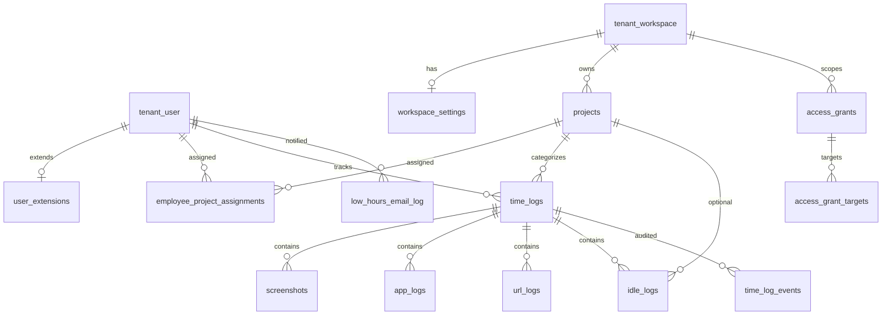

# Alyson Pulse — Database Schema (Research Doc)

> Feed this to GPT / investigators with `docs/ARCHITECTURE.md` and `docs/BACKEND_PIPELINE.md`.
> **Canonical production:** schema `time_doctor.*` on shared Palisade RDS (`revclouddb`) + identity FKs into `tenant.*`.
> **Do not treat as current:** `db/schema.sql`, `db/SCHEMA.md`, `db/migrations/001_pulse_additive.sql` (legacy `public.*` / TimeFlow naming).

Screenshot **binaries** live in **S3**; RDS stores metadata only (`screenshots.s3_key`).

---

## 1. Schema map

```
┌─────────────────────────────────────────────────────────────┐
│ tenant.*  (owned by Palisade — not migrated by this repo)   │
│  "user", workspace, profile, profile_workspace, account, …  │
└───────────────────────────┬─────────────────────────────────┘
                            │ FKs (INTEGER user_id / workspace_id)
┌───────────────────────────▼─────────────────────────────────┐
│ time_doctor.*  (this product)                               │
│  user_extensions, workspace_settings, projects,             │
│  employee_project_assignments, time_logs, screenshots,      │
│  app_logs, url_logs, idle_logs, low_hours_email_log,        │
│  access_grants, access_grant_targets, time_log_events       │
│  VIEW daily_activity_summary                                │
│  TRIGGER trg_time_log_events_audit on time_logs             │
└─────────────────────────────────────────────────────────────┘
```

**API DB role:** `alyson_time_doctor_api`  
**Extension required:** `pgcrypto` (`gen_random_uuid()`)

---

## 2. Entity relationships (production)



Naming note: there is **no** separate `sessions` table — a session **is** a `time_logs` row.

---

## 3. Migration inventory

| File | Purpose | Prod apply? |
|------|---------|-------------|
| `001_pulse_additive.sql` | Legacy `public.*` additive | **Skip** on Palisade |
| `002_time_doctor_schema.sql` | Create `time_doctor` + core tables + view + initial grants | **Yes** |
| `003_seed_pulse_test_user.sql` | QA seed (ws 510) | **No** |
| `004_seed_test_project.sql` | QA seed project | **No** |
| `005_backfill_time_doctor_extensions_for_legacy_users.sql` | Backfill extensions from Palisade memberships | Optional ops |
| `005_screenshot_interval_5min.sql` | Set interval=5 for ws **510** | In apply script (hardcoded 510 — often no-op on prod) |
| `006_workspace_team_and_admins.sql` | QA seed ws 511 | **No** |
| `007_screenshot_ai_analysis.sql` | AI columns + indexes + skip bad S3 keys | **Yes** |
| `008_access_grants.sql` | Delegated access tables | **Yes** |
| `009_grant_tenant_user_write.sql` | API write on tenant identity tables | Superseded by `prod/01` |
| `010_project_delete_fk_actions.sql` | Reassert project FK ON DELETE | **Yes** |
| `011_low_hours_email_period.sql` | `period_type`, `period_end` on email log | **Yes** |
| `012_fix_admin_palisade_registration.sql` | QA admin provision | **No** |
| `013_widen_low_hours_email_log_hours.sql` | `hours_*` → NUMERIC(8,2) | **Manual** (not in apply_schema.sh) |
| `014_time_log_events.sql` | Audit table + trigger | **Manual** |
| `014_time_log_events_grants.sql` | Re-apply event grants | **Manual** |
| `015_session_heartbeats.sql` | Liveness heartbeats for open sessions | **Manual (required for sprawl fix)** |
| `015_session_heartbeats_grants.sql` | Grants for heartbeats | **Manual** |

### Official `prod/apply_schema.sh` order

1. `002` → 2. `005_screenshot_interval_5min` → 3. `007` → 4. `008` → 5. `010` → 6. `011` → 7. `prod/01_grants_api_role.sql`

Then manually if needed: `013`, `014`, `014_grants`.

### Caveats

- **Duplicate numbers:** two `005_*`, two `014_*`.
- `prod/03_verify.sql` may look for `app_url_activity` but production table is **`url_logs`**.
- Seeds hardcode workspace `510` / `511` — never run unchanged on prod.

---

## 4. Tables — full column reference

### 4.1 `time_doctor.user_extensions` (002)

Pulse profile layer on top of `tenant."user"`.

| Column | Type | Null | Default | Notes |
|--------|------|------|---------|-------|
| `user_id` | INTEGER | NOT NULL | — | **PK**; FK → `tenant."user"(id)` ON DELETE CASCADE |
| `workspace_id` | INTEGER | NULL | — | FK → `tenant.workspace(id)` ON DELETE SET NULL |
| `cognito_sub` | TEXT | NULL | — | **UNIQUE**; Cognito subject |
| `manager_id` | INTEGER | NULL | — | FK → `tenant."user"(id)` ON DELETE SET NULL |
| `pulse_role` | TEXT | NOT NULL | `'employee'` | CHECK: `admin` \| `manager` \| `team_leader` \| `employee` |
| `department` | TEXT | NULL | — | |
| `location` | TEXT | NULL | — | |
| `last_activity` | TIMESTAMPTZ | NULL | `NOW()` | |
| `paused_at` | TIMESTAMPTZ | NULL | — | |
| `paused_by` | INTEGER | NULL | — | FK → `tenant."user"(id)` ON DELETE SET NULL |
| `pause_reason` | TEXT | NULL | — | |
| `created_at` | TIMESTAMPTZ | NOT NULL | `NOW()` | |
| `updated_at` | TIMESTAMPTZ | NOT NULL | `NOW()` | |

**Indexes:** `idx_td_user_ext_workspace`, `idx_td_user_ext_manager`, `idx_td_user_ext_cognito`

---

### 4.2 `time_doctor.workspace_settings` (002)

| Column | Type | Null | Default |
|--------|------|------|---------|
| `workspace_id` | INTEGER | NOT NULL | — | **PK**; FK → `tenant.workspace(id)` ON DELETE CASCADE |
| `settings` | JSONB | NOT NULL | see below |
| `updated_at` | TIMESTAMPTZ | NOT NULL | `NOW()` |

**Default `settings` JSON (002 DDL):**

```json
{
  "hours_threshold": 7,
  "high_activity_threshold": 60,
  "low_activity_threshold": 30,
  "screenshot_interval_minutes": 10
}
```

**Runtime JSON keys (no extra columns):** `screenshot_count_per_window` (1–8, default **2**), `screenshot_window_minutes` (5–120, default **10**), and derived `screenshot_interval_minutes` = `round(window / count)` for report math (2-in-10 → **5**). Current desktop builds use the N-in-M pair as a random window, not a fixed interval clock.

**Runtime nuances:**

- Nest sync `get_workspace_settings` may default `low_activity` to **10** if missing.
- Pulse clamps low-activity cutoff to **≤ 10%** for low-hours math regardless of stored 30.
- `prod/05_lower_low_activity_threshold.sql` sets `low_activity_threshold` to 10 where &gt;10 or null.
- `005_screenshot_interval_5min.sql` sets interval to 5 for workspace **510** only.

---

### 4.3 `time_doctor.projects` (002)

| Column | Type | Null | Default |
|--------|------|------|---------|
| `id` | UUID | NOT NULL | `gen_random_uuid()` | **PK** |
| `workspace_id` | INTEGER | NOT NULL | — | FK → `tenant.workspace(id)` ON DELETE CASCADE |
| `name` | TEXT | NOT NULL | — | |
| `description` | TEXT | NULL | — | |
| `created_at` / `updated_at` | TIMESTAMPTZ | NOT NULL | `NOW()` | |

**Index:** `idx_td_projects_workspace(workspace_id)`

---

### 4.4 `time_doctor.employee_project_assignments` (002, FK reasserted 010)

| Column | Type | Null | Default |
|--------|------|------|---------|
| `id` | UUID | NOT NULL | `gen_random_uuid()` | **PK** |
| `user_id` | INTEGER | NOT NULL | — | FK → `tenant."user"(id)` ON DELETE CASCADE |
| `project_id` | UUID | NOT NULL | — | FK → `projects(id)` ON DELETE **CASCADE** |
| `created_at` | TIMESTAMPTZ | NOT NULL | `NOW()` | |

**Unique:** `(user_id, project_id)`  
**Named FK:** `employee_project_assignments_project_id_fkey`

---

### 4.5 `time_doctor.time_logs` (002, FK 010, audited by 014)

**A work session = one row.** Open session: `end_time IS NULL` (and typically `status='active'`).

| Column | Type | Null | Default | Notes |
|--------|------|------|---------|-------|
| `id` | UUID | NOT NULL | `gen_random_uuid()` | **PK**; often client-generated |
| `user_id` | INTEGER | NOT NULL | — | FK → `tenant."user"(id)` ON DELETE CASCADE |
| `project_id` | UUID | NULL | — | FK → `projects(id)` ON DELETE **SET NULL** |
| `workspace_id` | INTEGER | NULL | — | FK → `tenant.workspace(id)` ON DELETE SET NULL |
| `start_time` | TIMESTAMPTZ | NOT NULL | `NOW()` | Wall-clock start |
| `end_time` | TIMESTAMPTZ | NULL | — | NULL = open |
| `status` | TEXT | NOT NULL | `'active'` | CHECK: `active` \| `paused` \| `completed` \| `auto_closed` |
| `idle_seconds` | INTEGER | NOT NULL | `0` | Desktop aggregate; sync uses GREATEST |
| `deducted_seconds` | INTEGER | NOT NULL | `0` | Screenshot-delete penalty; sync GREATEST; delete path **adds** |
| `device_id` | TEXT | NULL | — | Multi-device |
| `created_at` / `updated_at` | TIMESTAMPTZ | NOT NULL | `NOW()` | |

**Indexes:**  
- `idx_td_time_logs_user_start(user_id, start_time DESC)`  
- `idx_td_time_logs_workspace(workspace_id)`  

**Named FK:** `time_logs_project_id_fkey`

**Payroll semantics (application, not DB constraints):**

- Sync prefers lengthening; end_time generally monotonic forward.
- Exception: `authorized_idle_cut` may shorten end (still ≥ start + 30s in Nest).
- Pulse tracked hours = merged wall intervals (does **not** subtract idle/deducted).
- TimeDoctor API length = wall − deducted.

---

### 4.6 `time_doctor.screenshots` (002 + 007)

| Column | Type | Null | Default | Notes |
|--------|------|------|---------|-------|
| `id` | UUID | NOT NULL | `gen_random_uuid()` | **PK** |
| `user_id` | INTEGER | NOT NULL | — | FK → `tenant."user"(id)` ON DELETE CASCADE |
| `time_log_id` | UUID | NULL | — | FK → `time_logs(id)` ON DELETE SET NULL |
| `workspace_id` | INTEGER | NULL | — | FK → `tenant.workspace(id)` ON DELETE SET NULL |
| `s3_key` | TEXT | NULL | — | Object key in private bucket |
| `file_path` | TEXT | NOT NULL | `''` | Legacy path field |
| `file_size` | INTEGER | NULL | — | |
| `image_url` | TEXT | NULL | — | Often unused; prefer presigned GET |
| `captured_at` | TIMESTAMPTZ | NOT NULL | `NOW()` | |
| `activity_percent` | INTEGER | NOT NULL | `0` | Drives low-activity math |
| `focus_percent` | INTEGER | NOT NULL | `0` | |
| `mouse_clicks` | INTEGER | NOT NULL | `0` | |
| `keystrokes` | INTEGER | NOT NULL | `0` | |
| `mouse_movements` | INTEGER | NOT NULL | `0` | |
| `app_name` / `window_title` | TEXT | NULL | — | Meeting detection inputs |
| `agent_version` | TEXT | NULL | — | |
| `created_at` | TIMESTAMPTZ | NOT NULL | `NOW()` | |

**AI columns (007):**

| Column | Type | Null | Default | Constraints |
|--------|------|------|---------|-------------|
| `ai_analysis_status` | TEXT | NOT NULL | `'pending'` | CHECK: `pending` \| `queued` \| `processing` \| `completed` \| `failed` \| `skipped` |
| `ai_queued_at` / `ai_analyzed_at` | TIMESTAMPTZ | NULL | — | |
| `ai_retry_count` | INTEGER | NOT NULL | `0` | |
| `ai_error_message` | TEXT | NULL | — | |
| `ai_model_used` | TEXT | NULL | — | |
| `activity_type` / `category` | TEXT | NULL | — | |
| `is_work_related` | BOOLEAN | NULL | — | |
| `confidence_score` / `distraction_score` | INTEGER | NULL | — | CHECK NULL OR 0–100 |
| `vision_analysis` | JSONB | NULL | — | |
| `vision_summary` | TEXT | NULL | — | |

**Indexes:**  
- `idx_td_screenshots_user_captured(user_id, captured_at DESC)`  
- Partial backfill: `(ai_analysis_status, captured_at ASC)` WHERE status IN (`pending`,`failed`)  
- Partial completed: `(user_id, captured_at DESC)` WHERE status = `completed`

**007 data fix:** rows with missing/invalid `s3_key` → status `skipped`, error `missing_or_invalid_s3_key`.

---

### 4.7 `time_doctor.app_logs` (002)

| Column | Type | Null | Default |
|--------|------|------|---------|
| `id` | UUID | NOT NULL | `gen_random_uuid()` | **PK** |
| `user_id` | INTEGER | NOT NULL | — | FK → `tenant."user"(id)` CASCADE |
| `time_log_id` | UUID | NULL | — | FK → `time_logs` SET NULL |
| `workspace_id` | INTEGER | NULL | — | FK → `tenant.workspace` SET NULL |
| `app_name` | TEXT | NULL | — | |
| `window_title` | TEXT | NULL | — | |
| `started_at` / `ended_at` | TIMESTAMPTZ | NULL | — | Open focus: `ended_at` NULL |
| `timestamp` | TIMESTAMPTZ | NULL | `NOW()` | Column literally named `timestamp` |
| `created_at` | TIMESTAMPTZ | NOT NULL | `NOW()` | |

**Index:** `idx_td_app_logs_user_started(user_id, started_at DESC)`

---

### 4.8 `time_doctor.url_logs` (002)

**Not** named `app_url_activity` (that name is legacy `public` / SCHEMA.md).

| Column | Type | Null | Default |
|--------|------|------|---------|
| `id` | UUID | NOT NULL | `gen_random_uuid()` | **PK** |
| `user_id` | INTEGER | NOT NULL | — | FK → `tenant."user"(id)` CASCADE |
| `time_log_id` | UUID | NULL | — | FK → `time_logs` SET NULL |
| `workspace_id` | INTEGER | NULL | — | FK → `tenant.workspace` SET NULL |
| `site_url` | TEXT | NOT NULL | — | Required by sync insert |
| `title` / `domain` / `browser` | TEXT | NULL | — | |
| `started_at` | TIMESTAMPTZ | NOT NULL | `NOW()` | |
| `ended_at` | TIMESTAMPTZ | NULL | — | |
| `created_at` | TIMESTAMPTZ | NOT NULL | `NOW()` | |

**Index:** `idx_td_url_logs_user_started(user_id, started_at DESC)`

---

### 4.9 `time_doctor.idle_logs` (002, FK 010)

OS idle stretches (Pulse prefers these over `time_logs.idle_seconds` when present).

| Column | Type | Null | Default |
|--------|------|------|---------|
| `id` | UUID | NOT NULL | `gen_random_uuid()` | **PK** |
| `user_id` | INTEGER | NOT NULL | — | FK → `tenant."user"(id)` CASCADE |
| `time_log_id` | UUID | NULL | — | FK → `time_logs` SET NULL |
| `project_id` | UUID | NULL | — | FK → `projects(id)` ON DELETE **SET NULL** |
| `workspace_id` | INTEGER | NULL | — | FK → `tenant.workspace` SET NULL |
| `idle_start` | TIMESTAMPTZ | NOT NULL | — | |
| `idle_end` | TIMESTAMPTZ | NULL | — | |
| `duration_seconds` | INTEGER | NULL | — | Desktop may send aliases; store this |
| `created_at` | TIMESTAMPTZ | NOT NULL | `NOW()` | |

**Named FK:** `idle_logs_project_id_fkey`  
No secondary indexes in migrations.

**Reporting nuance:** Pulse ignores idle_logs shorter than **300 seconds** for hours reports.

---

### 4.10 `time_doctor.low_hours_email_log` (002 + 011 + 013)

| Column | Type | Null | Default | Evolution |
|--------|------|------|---------|-----------|
| `id` | UUID | NOT NULL | `gen_random_uuid()` | **PK** |
| `workspace_id` | INTEGER | NULL | — | FK → `tenant.workspace` CASCADE |
| `employee_id` | INTEGER | NOT NULL | — | FK → `tenant."user"(id)` CASCADE |
| `employee_email` | TEXT | NOT NULL | — | |
| `manager_email` | TEXT | NULL | — | |
| `work_date` | DATE | NOT NULL | — | Day or week-start |
| `hours_worked` | NUMERIC(**8**,2) | NOT NULL | — | Was NUMERIC(5,2) until 013 |
| `hours_threshold` | NUMERIC(**8**,2) | NOT NULL | — | Was NUMERIC(4,2) until 013 |
| `sent_by` | INTEGER | NULL | — | FK → `tenant."user"(id)` SET NULL |
| `status` | TEXT | NOT NULL | `'sent'` | **No CHECK** in SQL |
| `created_at` | TIMESTAMPTZ | NOT NULL | `NOW()` | |
| `period_type` | TEXT | NOT NULL | `'day'` | 011; **no CHECK** (app uses day/week/pace) |
| `period_end` | DATE | NULL | — | 011; backfilled `= work_date` |

**Index:** `idx_td_low_hours_workspace_date(workspace_id, work_date DESC)`

**Why 013 matters:** MTD / pace thresholds can exceed 99.99 (old NUMERIC(4,2) ceiling).

---

### 4.11 `time_doctor.access_grants` (008)

| Column | Type | Null | Default |
|--------|------|------|---------|
| `id` | SERIAL | NOT NULL | — | **PK** |
| `workspace_id` | INTEGER | NOT NULL | — | FK → `tenant.workspace` CASCADE |
| `grantee_user_id` | INTEGER | NOT NULL | — | Who receives access |
| `granted_by` | INTEGER | NOT NULL | — | Who granted |
| `created_at` / `updated_at` | TIMESTAMPTZ | NOT NULL | `NOW()` | |

**Unique:** `(workspace_id, grantee_user_id)`  
**Indexes:** grantee, workspace

---

### 4.12 `time_doctor.access_grant_targets` (008)

| Column | Type | Null | Default |
|--------|------|------|---------|
| `grant_id` | INTEGER | NOT NULL | — | FK → `access_grants(id)` CASCADE; **composite PK** |
| `target_user_id` | INTEGER | NOT NULL | — | FK → `tenant."user"(id)` CASCADE; **composite PK** |

**PK:** `(grant_id, target_user_id)`  
**Index:** `idx_td_access_grant_targets_target(target_user_id)`

---

### 4.13 `time_doctor.time_log_events` (014)

Append-only audit + desktop breadcrumbs. **No FK** from `time_log_id` → `time_logs` (survives log deletion).

| Column | Type | Null | Default |
|--------|------|------|---------|
| `id` | BIGSERIAL | NOT NULL | — | **PK** |
| `created_at` | TIMESTAMPTZ | NOT NULL | `NOW()` | |
| `user_id` | INTEGER | NOT NULL | — | FK → `tenant."user"(id)` CASCADE |
| `time_log_id` | UUID | NULL | — | No FK |
| `workspace_id` | INTEGER | NULL | — | FK → `tenant.workspace` SET NULL |
| `action` | TEXT | NOT NULL | — | See trigger actions / desktop actions |
| `source` | TEXT | NOT NULL | `'db-trigger'` | Desktop may send `desktop-agent` |
| `device_id` | TEXT | NULL | — | |
| `agent_version` / `request_id` | TEXT | NULL | — | Desktop breadcrumbs; trigger does not fill |
| `old_start_time` … `old_deducted_seconds` | mixed | NULL | — | Snapshot before UPDATE |
| `new_start_time` … `new_deducted_seconds` | mixed | NULL | — | Snapshot after |
| `duration_delta_seconds` | INTEGER | NULL | — | |
| `shortened` | BOOLEAN | NOT NULL | `FALSE` | TRUE when wall duration shrinks |
| `meta` | JSONB | NOT NULL | `'{}'` | e.g. CPU sample payload |

**Indexes:**  
- `(user_id, created_at DESC)`  
- `(time_log_id, created_at DESC)`  
- Partial `(created_at DESC) WHERE shortened = TRUE`

**Grants:** API role `SELECT, INSERT` only (no UPDATE/DELETE) — see `014_time_log_events_grants.sql`.

**Desktop insert example:** `action='cpu_sample'`, `source='desktop-agent'`, details in `meta` (does not change hours).

---

## 5. View — `time_doctor.daily_activity_summary` (002)

```sql
SELECT
  tl.user_id,
  DATE(tl.start_time AT TIME ZONE 'UTC') AS activity_date,  -- UTC, not Pacific
  COUNT(*) AS sessions_count,
  SUM(EXTRACT(EPOCH FROM (COALESCE(tl.end_time, NOW()) - tl.start_time))) AS total_seconds,
  SUM(tl.idle_seconds) AS total_idle_seconds,
  AVG(s.activity_percent) AS avg_activity_percent,
  COUNT(s.id) AS screenshots_count
FROM time_doctor.time_logs tl
LEFT JOIN time_doctor.screenshots s ON s.time_log_id = tl.id
WHERE tl.start_time IS NOT NULL
GROUP BY tl.user_id, DATE(tl.start_time AT TIME ZONE 'UTC');
```

**Footguns:**

1. Day bucket is **UTC**, not `America/Los_Angeles` — Pulse reports do **not** use this view.
2. LEFT JOIN to screenshots **multiplies** time_log rows before `COUNT(*)` / `SUM(total_seconds)` → inflated session counts/seconds when multiple screenshots exist.
3. Open sessions use `NOW()` → moving totals.
4. No `workspace_id` in output.
5. Unlike legacy `public.daily_activity_summary` in `schema.sql`, this view has **no** `security_invoker = on`.

---

## 6. Trigger — `time_log_events` audit (014)

| Object | Name |
|--------|------|
| Function | `time_doctor.fn_time_log_events_audit()` |
| Trigger | `trg_time_log_events_audit` |
| Timing | `AFTER INSERT OR UPDATE ON time_doctor.time_logs FOR EACH ROW` |

**INSERT:** action `create`; only new_* fields; `meta.op=INSERT`.

**UPDATE no-op** (start/end/status/idle/deducted unchanged): skip row.

**UPDATE classification (priority):**

1. Default `update`
2. → `screenshot_deduct` if `deducted_seconds` rose and `end_time` unchanged
3. → `close` if status becomes `completed`
4. → `shorten` if closed duration shrinks **or** `new_end < old_end` (**overrides** prior action)

Duration = `GREATEST(0, epoch(end−start)::int)` when both ends present.  
Does **not** fire on DELETE. Does not populate `agent_version` / `request_id`.

**Use for silent-time research:** query `WHERE shortened = TRUE` and inspect `old_end_time` / `new_end_time` / `duration_delta_seconds`.

---

## 7. Project delete FK actions (010)

| Child | ON DELETE |
|-------|-----------|
| `employee_project_assignments.project_id` | **CASCADE** |
| `time_logs.project_id` | **SET NULL** |
| `idle_logs.project_id` | **SET NULL** |

Deleting a project does **not** delete time_logs; it nulls `project_id`.

---

## 8. Referenced `tenant.*` (not owned here)

| Table | Typical columns used | How |
|-------|----------------------|-----|
| `tenant."user"` | `id`, `email`, `first_name`, `last_name`, `phone_number`, `active` | FKs + invites |
| `tenant.workspace` | `id`, `name`, `account_id` | Org boundary |
| `tenant.profile` | `id`, `user_id`, `name`, `profile_type`, `email`, `active` | Membership |
| `tenant.profile_workspace` | `profile_id`, `workspace_id`, roles, `active` | Workspace membership |
| `tenant.account` | `id`, `name`, `user_id`, contacts, `active` | Account layer |
| `tenant.user_notification_settings` | (grants only) | Invite side effects |

002 initially grants **SELECT-only** on identity; `009` / `prod/01` add write for Cognito invite provisioning.

---

## 9. Roles & grants

**Role:** `alyson_time_doctor_api`

| Source | Grants |
|--------|--------|
| 002 | USAGE on `time_doctor`; CRUD tables; SELECT view; USAGE `tenant` + SELECT identity tables; default privileges on future `time_doctor` tables |
| 009 / prod/01 | Write on `tenant.user`, `account`, `profile`, `profile_workspace`, `user_notification_settings` + sequences |
| 014 / 014_grants | `SELECT, INSERT` on `time_log_events` + sequence USAGE/SELECT |

**After adding tables:** re-run `prod/01_grants_api_role.sql` and/or `014_grants` so the API role can access new objects.

---

## 10. Dual-schema cheat sheet

| Concern | Legacy `public` (`schema.sql` / 001 / SCHEMA.md) | Production `time_doctor` |
|---------|--------------------------------------------------|---------------------------|
| Identity | `users` UUID (= Cognito) | `tenant."user"` INTEGER + `user_extensions` |
| Org | `organizations` / `organization_id` | `tenant.workspace` / `workspace_id` |
| Settings | `org_settings` | `workspace_settings` |
| URLs | `app_url_activity` | **`url_logs`** |
| Access grants / audit / AI cols | Absent | 008 / 014 / 007 |
| Daily view TZ | UTC (+ security_invoker in schema.sql) | UTC, no security_invoker |

---

## 11. Useful research queries

```sql
-- Sessions that were shortened (possible idle cut / bad update)
SELECT *
FROM time_doctor.time_log_events
WHERE shortened = TRUE
ORDER BY created_at DESC
LIMIT 100;

-- Open sessions (still tracking or abandoned)
SELECT id, user_id, device_id, start_time, status, idle_seconds, deducted_seconds
FROM time_doctor.time_logs
WHERE end_time IS NULL
ORDER BY start_time DESC;

-- Compare idle_logs vs session idle_seconds for a user/day (UTC example — prefer app Pacific bounds)
SELECT *
FROM time_doctor.idle_logs
WHERE user_id = $1
  AND idle_start >= $2
  AND idle_start < $3;

-- Low-activity screenshots (< 10%) for a session
SELECT id, captured_at, activity_percent, app_name, window_title
FROM time_doctor.screenshots
WHERE time_log_id = $1
  AND activity_percent < 10
ORDER BY captured_at;
```

---

## 12. Table checklist

| # | Object | Created |
|---|--------|---------|
| 1 | `user_extensions` | 002 |
| 2 | `workspace_settings` | 002 |
| 3 | `projects` | 002 |
| 4 | `employee_project_assignments` | 002 |
| 5 | `time_logs` | 002 |
| 6 | `screenshots` (+ AI cols) | 002 / 007 |
| 7 | `app_logs` | 002 |
| 8 | `url_logs` | 002 |
| 9 | `idle_logs` | 002 |
| 10 | `low_hours_email_log` | 002 / 011 / 013 |
| 11 | `access_grants` | 008 |
| 12 | `access_grant_targets` | 008 |
| 13 | `time_log_events` | 014 |
| 14 | `session_heartbeats` | 015 |
| — | VIEW `daily_activity_summary` | 002 |
| — | FN + TRG audit | 014 |

### 4.14 `time_doctor.session_heartbeats` (015)

Append-only desktop liveness telemetry. Screenshots are **not** the sole liveness signal (they pause on lock/meeting/battery).

| Column | Type | Null | Default |
|--------|------|------|---------|
| `id` | BIGSERIAL | NOT NULL | — | **PK** |
| `created_at` | TIMESTAMPTZ | NOT NULL | `NOW()` | |
| `time_log_id` | UUID | NULL | — | FK → `time_logs(id)` ON DELETE SET NULL |
| `user_id` | INTEGER | NOT NULL | — | FK → `tenant."user"(id)` CASCADE |
| `device_id` | TEXT | NULL | — | |
| `workspace_id` | INTEGER | NULL | — | FK → `tenant.workspace` SET NULL |
| `seen_at` | TIMESTAMPTZ | NOT NULL | — | Agent-reported liveness instant |
| `reason` | TEXT | NULL | — | e.g. `checkpoint`, `interval` |
| `agent_version` | TEXT | NULL | — | |
| `meta` | JSONB | NOT NULL | `'{}'` | |

**Indexes:** `(time_log_id, seen_at DESC)`, `(user_id, seen_at DESC)`, partial device

**Safety rule:** Heartbeats are for detection/flagging only. They must **not** be used alone as an automatic `time_logs.end_time`. Closes require local durable checkpoint confirmation or admin confirmation (`confirm_stale_session_close`).

---

## 13. Related docs

- `docs/ARCHITECTURE.md` — system + desktop recording
- `docs/BACKEND_PIPELINE.md` — sync actions, Pulse formulas, mismatch register
- `db/README.md` / `db/prod/README.md` — apply procedures
- `db/SCHEMA.md` — **legacy simplified public naming** (incomplete vs production)
