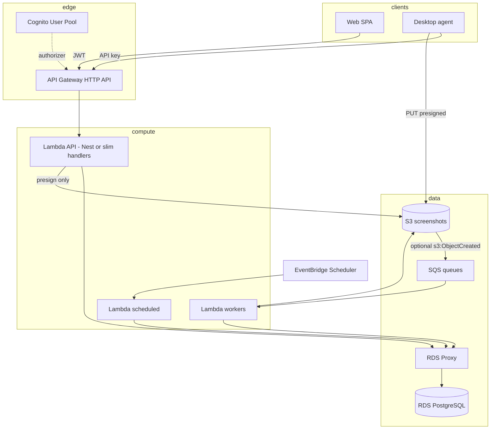

# NestJS backend → AWS serverless

This guide maps the TimeFlow **NestJS** backend (`backend/`) to a serverless AWS architecture. It builds on work already in this repo:

- [aws-rds-setup.md](./aws-rds-setup.md) — RDS PostgreSQL
- [screenshot-s3-serverless.md](./screenshot-s3-serverless.md) — presigned S3 upload/read (no binaries through API)
- [supabase-to-rds-schema-migration.md](./supabase-to-rds-schema-migration.md) — data plane off Supabase
- `rds/migrations/001_aws_cognito_s3.sql` — `cognito_sub`, `s3_key`

## Current backend (what must change)

| Capability | Today | Serverless constraint |
|------------|--------|------------------------|
| HTTP REST | Nest on port 3000 | ✅ API Gateway + Lambda (or App Runner container) |
| `/data/*`, `/auth/*`, `/sync/*` | RDS + Cognito + S3 | ✅ Primary migration target (already RDS-shaped) |
| GraphQL + WebSocket subscriptions | Apollo + Redis pubsub | ❌ Not a fit for standard REST API Gateway; use REST `/data/*` or AppSync later |
| Bull / Redis queues | 5 processors | → **SQS** + Lambda (or Step Functions) |
| `@nestjs/schedule` cron | In-process timers | → **EventBridge** rules → Lambda |
| Multipart screenshot batch upload | `POST /api/screenshots/batch` | Prefer **presigned S3** path (`/sync/desktop-action`) — already serverless-friendly |
| AI analysis | Supabase edge + Bull | → Lambda (container if using **sharp**) or keep edge until cutover |
| Long-running `force-sync` / reports | Single Node process | Lambda **15 min max**; heavy jobs → async SQS + status table |

## Target architecture



## Recommended deployment model

### Option A — **Lambda container image** (recommended for this codebase)

- Package the existing Nest app in a **Docker image** (Node 20, `sharp`, `pg`).
- Single Lambda behind **API Gateway HTTP API** with `@codegenie/serverless-express` (cache the Nest app on cold start).
- Set `SERVERLESS_MODE=1` to disable Bull, GraphQL, and in-process schedulers in Lambda (see `backend/src/app.module.ts`).
- **Pros:** Reuse controllers/services; one deploy unit for `/data`, `/sync`, `/auth`, `/health`.
- **Cons:** Cold starts (mitigate with provisioned concurrency on prod); 15 min timeout.

### Option B — **AWS App Runner** (fastest lift-and-shift)

- Run the same Docker image as today (no Lambda adapter).
- Still use RDS, S3, Cognito; keep Redis/Bull on **ElastiCache** until phase 2.
- **Pros:** Minimal code change; no cold-start refactor; WebSocket/GraphQL possible short-term.
- **Cons:** Always-on cost; not per-request serverless.

### Option C — **Split handlers** (max serverless purity)

- Thin Lambda per route group (`data`, `sync`, `workers`) sharing a `libs/db` package.
- **Pros:** Smallest bundles, independent scaling.
- **Cons:** Highest refactor cost; duplicate auth/validation unless shared lib is strict.

**Practical path:** **A** for the API cutover, **SQS + Lambda** for workers, retire Redis/Bull in phase 2.

## Phase plan

### Phase 0 — Prerequisites (mostly in progress)

- [ ] RDS live with schema from Supabase migration scripts
- [ ] Cognito pool; web/desktop use IdToken; `users.cognito_sub` populated
- [ ] S3 bucket private; desktop uses `screenshot_upload_init` / `complete` only
- [ ] Web + agent call backend for reads/writes (not `supabase.from()` for core tables)
- [ ] `DATABASE_*` or `DATABASE_URL` + **RDS Proxy** endpoint for Lambda

### Phase 1 — Serverless HTTP API

1. Add `backend/src/lambda.ts` — cached `serverlessExpress` wrapper around the same bootstrap as `main.ts`.
2. `SERVERLESS_MODE=1` in Lambda env: skip Bull, GraphQL, `ScheduleModule`.
3. Deploy `infra/sam/` (or CDK): API Gateway HTTP API → Lambda (image), IAM for S3 presign, VPC + RDS Proxy security groups.
4. Route traffic:
   - **Web:** `VITE_BACKEND_URL` → API Gateway URL; Cognito JWT on `/data/*`, `/auth/*`.
   - **Agent:** `BACKEND_API_URL` → `POST /sync/desktop-action`; `INTERNAL_API_KEY`.
5. Keep **one** long-lived dev server (`npm run start:dev`) until cutover; production only on Lambda.

**API Gateway**

- HTTP API (cheaper than REST API v1).
- **JWT authorizer** (Cognito) for `/data/*`, `/auth/*`.
- **API key** (or Lambda custom authorizer) for `/sync/*`.
- CORS: same `ALLOWED_ORIGINS` list as `main.ts`.
- Throttling: API Gateway usage plans + Nest `ThrottlerGuard` where still mounted.

### Phase 2 — Background work without Redis

| Bull queue | Replacement |
|------------|-------------|
| `activity-analyzer` | EventBridge rate(5 min) → Lambda → SQL/RDS |
| `unusual-detector` | EventBridge rate(10 min) → Lambda |
| `notification-pusher` | EventBridge rate(1 min) → Lambda → SES/Slack |
| `ai-analysis` | SQS (batch size 1–10) ← EventBridge or manual `POST /ai-analysis/trigger` |
| `suspicious-activity-detector` | Same as unusual-detector or shared cron Lambda |

- Remove `BullModule` when all producers/consumers are migrated.
- **Idempotency:** use job keys in Postgres or SQS deduplication where needed.

### Phase 3 — Retire incompatible features

- **GraphQL subscriptions:** remove from production (`DISABLE_GRAPHQL=1`) or replace with polling/SSE on web.
- **Supabase** service role: delete `SupabaseService` usage from hot paths once RDS API is complete.
- **Supabase Edge Functions:** port `ai-screenshot-analyzer` to Lambda (reuse logic from `supabase/functions/ai-screenshot-analyzer`).

### Phase 4 — Hardening

- Secrets Manager for `DATABASE_PASSWORD`, `INTERNAL_API_KEY`, SMTP, Slack.
- WAF on API Gateway (rate limit, geo if needed).
- X-Ray or Sentry (already in `backend/src/lib/sentry.ts`).
- Provisioned concurrency on API Lambda if p95 latency matters.

## Environment variables (Lambda)

| Variable | Purpose |
|----------|---------|
| `NODE_ENV=production` | Disable Swagger/playground |
| `SERVERLESS_MODE=1` | No Bull/GraphQL/schedule in process |
| `DISABLE_GRAPHQL=1` | Explicit GraphQL off |
| `DATABASE_HOST` / `DATABASE_PASSWORD` | Prefer over URL (special chars); target **RDS Proxy** host |
| `DATABASE_POOL_MAX=2` | Small pool per Lambda instance |
| `AWS_S3_*` | Presign (see screenshot-s3-serverless.md) |
| `COGNITO_*` | JWT validation in `AuthGuard` |
| `INTERNAL_API_KEY` | Desktop `/sync/*` |
| `ALLOWED_ORIGINS` | CORS |

## IAM (API Lambda role)

- `s3:PutObject`, `s3:GetObject` on `arn:aws:s3:::BUCKET/PREFIX/*`
- `cognito-idp:GetUser` (if validating server-side beyond API GW authorizer)
- VPC: `ec2:CreateNetworkInterface` for RDS Proxy subnets
- No S3 access on agent credentials (presigned URLs only)

## What not to put through Lambda

- **JPEG bodies** — agent → presigned PUT → S3 (documented).
- **Large report generation** — generate to S3, return presigned GET, or run on Fargate if >15 min.
- **Persistent WebSocket** — use AppSync, API Gateway WebSocket + DynamoDB, or drop feature.

## Local development

```bash
cd backend
docker compose up -d postgres redis   # redis only until Bull retired
cp .env.example .env
npm run start:dev
```

Simulate Lambda locally with [AWS SAM CLI](https://docs.aws.amazon.com/serverless-application-model/latest/developerguide/serverless-sam-cli-install.html) once `infra/sam/template.yaml` is wired (see `infra/sam/README.md`).

## Cost sketch (~50 users, us-west-2)

| Service | ~Monthly |
|---------|----------|
| RDS db.t4g.small | $25–35 |
| RDS Proxy | ~$15–20 |
| Lambda API (low traffic) | $0–5 |
| API Gateway HTTP | $1–3 |
| S3 + Cognito | $1–10 |
| SQS + worker Lambda | $1–5 |

App Runner adds ~$25–50/month minimum but saves Lambda cold-start engineering.

## Repo layout (suggested)

```
infra/sam/template.yaml    # API Gateway + Lambda + IAM
backend/Dockerfile.lambda    # Container image for API Lambda
backend/src/lambda.ts        # serverless-express entry
backend/src/app.module.ts    # SERVERLESS_MODE conditionals
docs/nestjs-aws-serverless.md  # this file
```

## Next actions in code

1. Finish RDS + Cognito + S3 paths for web/agent (in progress on branch).
2. Add `SERVERLESS_MODE` and `lambda.ts`; add `@codegenie/serverless-express` + `pg` to `backend/package.json`.
3. Deploy SAM stack to a dev stage; point agent `BACKEND_API_URL` at API Gateway.
4. Move one Bull processor to EventBridge + Lambda; validate; repeat.
5. Turn off GraphQL and Redis in production Lambda env.
