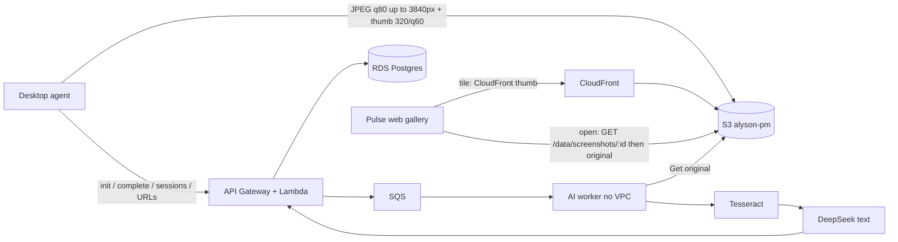

# Research brief: Alyson Pulse — reduce AWS data movement / screenshot cost

Hand this file to another model (GPT, Claude, etc.) as source of truth. Do **not** invent our architecture. Challenge assumptions if there are better industry patterns (time-tracking, RMM, DLP, screenshot pipelines).

**Date of this brief:** 2026-09-01.

---

## Goal

Cut **AWS cost driven by moving screenshot, session, and URL data**, without breaking the product constraints below.

We run **Alyson Pulse**, an employee time-tracking product (~20 users).

---

## What we are optimizing

The bill we care about is AWS Cost Explorer **tagged `team=Alyson PM`** in account `221490242148`, region `us-west-2`.

Recent tagged spend was roughly **$144–$176/mo** at ~20 users (August-like). After thumbs + N-in-M we expect ~**$90/mo tagged** once Pulse web and a desktop release actually use them; closer to **~$120** until those ships.

- **Do not include Amazon Rekognition** in savings math. It was untagged and never on this final bill (we also removed it from the app).
- **DeepSeek** is a separate vendor invoice, not tagged AWS.
- Shared Palisade infra (VPC, Cognito, RDS, S3 bucket `alyson-pm`) is **not Pulse-only**. Do not recommend deleting those.

---

## Product constraints (hard)

1. **Capture cadence is workspace-configurable random N-in-M**, default **2 shots per 10 minutes**. Pulse Workspace Settings writes `screenshot_count_per_window` + `screenshot_window_minutes`. `screenshot_interval_minutes` is **derived report math** (`round(window / count)`, so 2/10 → 5). Do **not** treat a single interval field as the capture clock, and do **not** reject the N-in-M UI as “raising the interval.” Do not go back to a 30s/60s fixed clock.
2. **Do not delete screenshot AI.** Pipeline must stay: desktop upload → API → SQS → worker (no VPC) → S3 Get → Tesseract OCR → DeepSeek **text** (`deepseek-chat`) → persist. **Images are not sent to DeepSeek.**
3. Pulse web thumbs + Workspace Settings code is the intended Palisade `qa` frontend. Do **not** reject tiles that prefer `thumb_url`, lightbox `GET /data/screenshots/:id`, or omitting `full=1` on the gallery list. CSV export may still send `full=1`. Desktop N-in-M / 320px thumbs still need a **desktop release**.
4. Do not delete prod SQS / Lambda VPC endpoints.
5. Do not replace the whole `alyson-pm` bucket policy or lifecycle (merge by Sid/ID only).
6. Lambda env has a **4KB limit**. CloudFront HMAC + domain live in `s3://alyson-pm/alyson-td-internal/thumb-cdn.json`, not Lambda env.

---

## Repos

| Repo | Role |
|---|---|
| `alyson-time-doctor` | NestJS API, Electron desktop agent, AWS SAM (`infra/sam`) |
| `Palisade-web-from-github` | Pulse React UI (Ant Design, Vite) |
| `palisade-be` | Shared Palisade backend (not Pulse-only) |

Frontend for Pulse is hosted on Palisade (Loveable mentioned historically; current UI is Palisade-web).

---

## AWS / prod facts

- Stack: `alyson-time-doctor-api-prod`
- API: `https://rxbi86aui3.execute-api.us-west-2.amazonaws.com`
- S3: `alyson-pm` (shared). Screenshot prefix: `alyson-td-screenshots/`
- Thumb CDN: CloudFront `d5s1eyv2hvbs5.cloudfront.net` (dist `E34Y0DN98KK6N9`), private bucket + OAC, HMAC on `*.thumb.jpg` only
- RDS via prod proxy `palisade-be-prod-time-doctor-proxy`
- Dev API stack was **deleted** (`alyson-time-doctor-api-dev`) to save ENI cost
- Latest API image deployed: `alyson-time-doctor-api:20260901013501-11b3587` (health 200; includes workspace schedule fields)

---

## Current request graph

---

## Data we move (research target)

### 1. Screenshots (vast majority of bytes)

Desktop flow per capture:

1. Multi-monitor stitch, max edge **3840px**, then JPEG **quality 80** (sharp; nativeImage fallback).
2. `screenshot_upload_init` → presigned PUT for original + optional `thumb_upload_url`.
3. Agent PUTs original to S3, and a sibling thumb `…/id.thumb.jpg` (**320px / q60** after latest deploy; older thumbs may still be 480/q70).
4. `screenshot_upload_complete` writes RDS row (`time_doctor.screenshots`) with `s3_key`, `thumb_s3_key`, metadata.
5. SQS job: worker Gets **original**, Tesseract OCR, DeepSeek text, writes `vision_analysis` JSONB + `vision_summary`. Worker also (re)writes thumb from the original buffer.

Browsing:

- Pulse Screenshots gallery pages **12** tiles.
- **API now live:** `GET /data/screenshots` signs **`thumb_url` only** (CloudFront HMAC). Originals omitted unless `full=1` (CSV export) or there is no thumb yet.
- `GET /data/screenshots/:id` returns `image_url` (S3 presign of original). Intended for lightbox only.
- **Palisade-web (qa):** gallery tiles use `thumb_url || image_url`. List does not send `full=1`. Lightbox opens immediately on the thumb, then `GET /data/screenshots/:id` upgrades to the original. Tile `onError` may fetch the original as a last resort if CloudFront thumbs fail.
- Lightbox / “open” still downloads the **full original** (up to 3840px q80).
- Desktop agent gallery: tiles prefer `thumb_url`. Needs a **desktop release** for new 320px thumbs, adaptive original cap, and workspace-driven N-in-M.

S3 lifecycle (applied on last deploy): prefix `alyson-td-screenshots/` → **Glacier Instant Retrieval after 30 days**. No delete. Pulse can still open cold objects (retrieval fee). Does **not** reduce browsing of *new* objects.

### 2. Sessions / app logs / URL logs (tiny bytes, many requests)

Desktop already queues:

- Sync flush ~**every 10s** (`sync-manager`)
- URL batch flush ~**every 15s** (also 1s flush timer / batch 50)
- Activity IPC ~30s

These are small JSON to `POST /sync/desktop-action` → API GW + Lambda + RDS inserts. They **feel** chatty. They are **not** the GB problem.

We considered “store locally, upload every 10 minutes.” Hypothesis to test: that cuts **invocation count**, not S3/RDS storage or screenshot egress. Pulse live view and AI would go stale. Crash risk unless JPEGs are also persisted locally (heavy).

---

## What we already shipped (do not re-recommend as net-new)

- Rekognition → **Tesseract** (not on tagged bill anyway)
- List API no longer returns fat `vision_analysis` blobs
- Deleted unused **dev** SAM stack
- Gallery thumbs + CloudFront for `*.thumb.jpg`
- Faster Tesseract preprocess (rotate, cap 1600px, grayscale JPEG) on worker
- Thumbs-only list + on-demand `GET :id` (API **prod live**)
- New thumb encode 320/q60 (API live; desktop code local until release)
- Glacier IR @ 30d on screenshot prefix (live)
- List default cap 200 (Pulse already sends `limit=12`)
- Workspace JSON: `screenshot_count_per_window` + `screenshot_window_minutes` (API live; Pulse Settings UI on `qa`)

---

## What we explicitly did not do

- Cap original upload size (still 3840 / q80)
- Stop storing originals (lightbox = thumb only)
- Revert to a 30s/60s fixed capture clock (N-in-M is the intended schedule)
- Delete old full images
- Stop persisting `vision_analysis` JSONB (list just doesn’t return it)
- 10-minute local buffer for screenshots/sessions/URLs

---

## Cost intuition we are using (challenge this)

| Lever | Affects | Expected tagged impact |
|---|---|---|
| Pulse + desktop use `thumb_url` on tiles | Browse GET bytes | The remaining ~$20–30/mo CloudFront/S3 browse cut we already counted |
| Lightbox still loads original | Browse GET on click | Smaller; depends how often managers open shots |
| Glacier IR @ 30d | Storage of old objects | ~$1/mo, not browse |
| 10-min local buffer of sessions/URLs | API GW + Lambda invocations | Likely a few dollars/mo at 20 users |
| 10-min buffer of screenshots | Delay only | **Same S3 PUT bytes** |
| Cap original to ~1920 / q70 | Every PUT, AI Get, lightbox Get, storage | Real ingest cut; softer 4K lightbox |
| Configurable N-in-M (default 2/10) | Capture count + PUT/AI/storage | Intended; do not flag as forbidden |

Rough after tagged cuts if thumbs are actually used: **~$175 → ~$90/mo** (~$4.50/user). Until Pulse web + desktop **releases** use `thumb_url`, expect closer to **~$120** (~$6/user). Treat these as planning numbers, not invoices.

---

## Open research questions

1. For a 20-user time-tracker that **keeps screenshot AI** and a workspace-set random N-in-M cadence (default 2/10), what are the highest-ROI ways to cut **S3 PUT/GET + CloudFront + RDS + API GW/Lambda** in 2026 AWS pricing?
2. Is a **10-minute local buffer** (disk queue, then batch upload) worth it for (a) screenshots, (b) sessions, (c) URL logs? Quantify invocation vs GB vs product risk (staleness, crash loss, AI delay, Pulse live view).
3. Industry patterns: store **thumb only** in hot S3 and keep original locally / cold / not at all until a manager opens? Compare to Time Doctor, Hubstaff, ActivTrak, Teramind-style designs.
4. Should we **cap the original** (e.g. 1920px / JPEG 70) vs add a third “preview” object vs lightbox-from-thumb-only? Quality vs cost for multi-monitor stitches.
5. Is Glacier IR the right cold class if managers still open 30–90 day screenshots in Pulse? Compare GIR vs Glacier Flexible vs Intelligent-Tiering vs expire.
6. RDS: `vision_analysis` JSONB + high-frequency URL/session inserts — any material cost vs S3? TOAST bloat, IOPS, Proxy?
7. API Gateway HTTP API + container Lambda on **every** desktop-action vs batching into one payload every N minutes — break-even at 20 vs 200 users.
8. Any cheaper OCR/AI topology that keeps Tesseract + DeepSeek-text and does **not** Get the full original every time (e.g. OCR from thumb, skip AI if hash duplicate)?
9. What should we measure for 2 weeks to validate (Cost Explorer metrics, S3 bytes, CF bytes, Lambda invocations, RDS write IOPS)?

---

## Please return

- Ranked recommendations with **estimated $/mo at 20 users** and at **200 users**
- What we should **not** do
- Implementation complexity (desktop vs API vs S3 only)
- Product/UX risk
- Citations or AWS pricing assumptions (date them)
